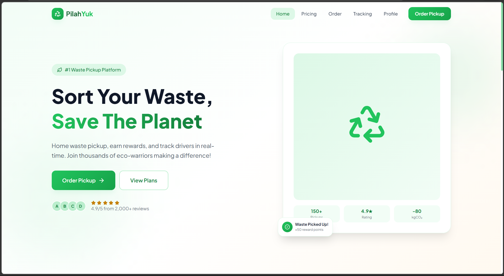
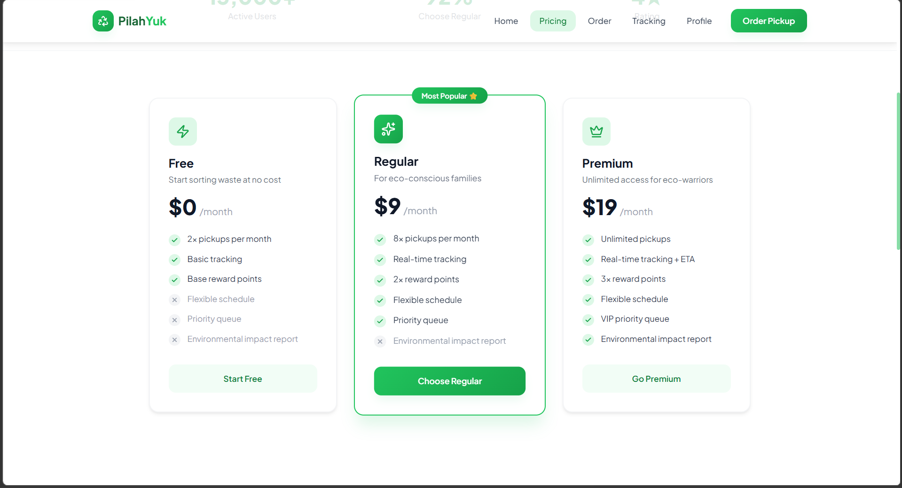
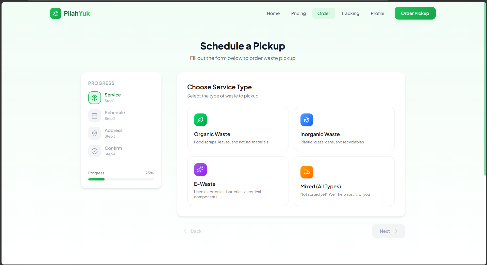
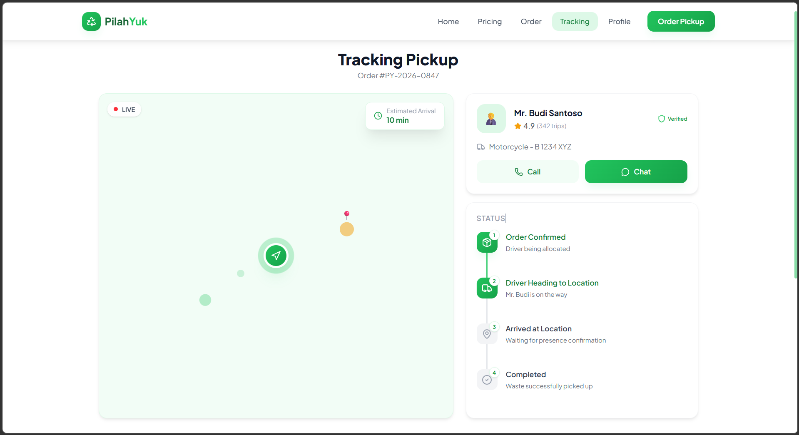
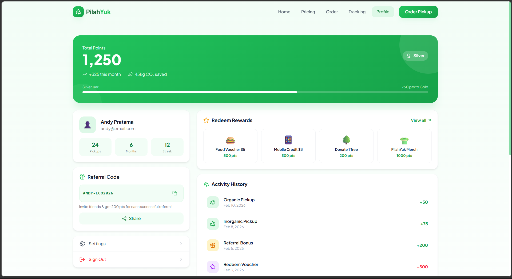

# PilahYuk - Sustainable Waste Management Platform


**#1 Waste Pickup Platform** | Home waste pickup, earn rewards, and track drivers in real-time

[](https://pilahyuk.vercel.app)
[](https://nextjs.org/)
[](https://www.typescriptlang.org/)
[](https://tailwindcss.com/)

## 🌍 The Problem

Indonesia generates **68 million tons of waste annually**, with only **12% properly sorted and recycled**. Urban middle-class families produce 3-8 kg of valuable recyclable waste per month, but it ends up in landfills or burned due to three major pain points:

1. **Waste banks are too far away** with unclear schedules
2. **No convenient pickup service** for sorted waste
3. **Low rewards** that don't justify the sorting effort

Result: 25-30 million urban households have recyclable waste worth recycling, but lack accessible infrastructure.

## 💡 Our Solution

**PilahYuk** is a digital platform that picks up sorted waste from homes with a fixed schedule. Users earn instant rewards and can track their environmental impact.

### Value Proposition

- **Fixed pickup schedule**: Weekly or daily pickups
- **Instant rewards**: GoPay or mobile credit within 24 hours
- **Doorstep convenience**: No need to leave home
- **Monthly impact reports**: Track CO2 saved and waste diverted
- **Simple flow**: Book → Sort → Driver picks up → Reward arrives → Waste recycled

## ✨ Key Features

### 1. Home Pickup Service
- Schedule waste pickup through the app
- Choose from 3 subscription tiers: Free, Regular ($9/month), Premium ($19/month)
- Fixed, predictable pickup schedule (2x to unlimited pickups per month)

### 2. Real-Time Tracking
- Live map showing driver location
- Estimated arrival time
- Driver profile with ratings
- Call or chat with driver directly

### 3. Gamified Rewards System
- Earn points for every pickup
- Redeem for food vouchers, mobile credit, tree donations, or merchandise
- Tier system (Silver, Gold) with increasing benefits
- Referral program: 200 points per successful referral
- Environmental impact dashboard: CO2 saved, waste diverted from landfills

### 4. Multi-Waste Type Support
- **Inorganic Waste**: Plastic, glass, cans, recyclables
- **Organic Waste**: Food scraps, leaves, natural materials
- **E-Waste**: Electronics, batteries, electrical components
- **Mixed**: Unsorted waste with assisted sorting

## 🎨 Screenshots

### Homepage

*Clean hero section with clear value proposition and social proof*

### Pricing Plans

*Three subscription tiers with transparent feature comparison*

### Order Flow

*Multi-step booking form with progress tracker*

### Real-Time Tracking

*Live map with driver info and pickup status timeline*

### Profile & Rewards

*Gamified dashboard with points, rewards, and environmental impact*

## 🛠️ Tech Stack

### Frontend
- **Framework**: Next.js 16.1.6 (App Router)
- **Language**: TypeScript 5.0
- **Styling**: Tailwind CSS 4.0
- **Animations**: Framer Motion 12.34.0
- **Icons**: Lucide React 0.563.0

### Development
- **Package Manager**: npm
- **Linting**: ESLint 9
- **Deployment**: Vercel

### Architecture
- **Type**: Static prototype demonstrating complete user flow
- **Focus**: UI/UX design and user journey visualization
- **Status**: Functional frontend without backend validation

## 🚀 Getting Started

### Prerequisites
- Node.js 20+ installed
- npm or yarn package manager

### Installation

1. Clone the repository
```bash
git clone https://github.com/neezar-abd/PilahYuk.git
cd PilahYuk
```

2. Install dependencies
```bash
npm install
```

3. Run development server
```bash
npm run dev
```

4. Open browser
```
http://localhost:3000
```

### Build for Production
```bash
npm run build
npm start
```

## 📱 User Flow

1. **Landing** → User discovers PilahYuk value proposition
2. **View Plans** → Compare subscription tiers
3. **Order Pickup** → Choose waste type, schedule, and address
4. **Track Driver** → Real-time map and status updates
5. **Earn Rewards** → Points automatically credited after pickup
6. **Redeem** → Exchange points for vouchers or donations
7. **View Impact** → Dashboard showing environmental contribution

## 💰 Business Model

### Revenue Streams

1. **Subscription (70% of revenue)**
   - Free: $0/month (2 pickups, basic features)
   - Regular: $9/month (8 pickups, real-time tracking, 2x rewards)
   - Premium: $19/month (unlimited pickups, 3x rewards, priority queue)

2. **Waste Material Margin (25% of revenue)**
   - Direct sales to recycling factories
   - Average blended margin: 45-65% vs competitors' 20-40%
   - Price per kg: Plastic $3.5, Paper $2.8, Metal $8.5, Glass $1.2

3. **B2B Services (5% year 1, target 20% year 2)**
   - Office waste management: $500/month per 20 employees
   - School programs: $300/month per 100 students

### Competitive Advantage

**Higher margins through:**
- Direct sales to recycling factories (no middlemen)
- Bulk collection for better pricing
- Quality sorting at facility (factories pay premium)

## 🎯 Target Market

### Primary: Urban Middle-Class Families
- Age: 25-45 years old
- Household size: 2-4 people
- Income: $800-2000/month
- Location: Surabaya (initial), expanding to major Indonesian cities
- Characteristics: Environmentally conscious but time-constrained

### Market Size
- **Total Addressable Market**: 500,000 households in Surabaya
- **Target**: 1% market penetration (5,000 households)
- **Projected Annual Revenue**: $1.7M at 1% penetration

### Secondary: Corporate Clients
- Offices with 20-100 employees
- Schools with environmental programs
- Target Year 2: 200 corporate clients

## 🏆 Competition

| Feature | PilahYuk | SampahKu | Bank Sampah | Waste4Change | Gringgo |
|---------|----------|----------|-------------|--------------|---------|
| Home pickup | ✅ | ✅ | ❌ | ✅ (expensive) | ❌ |
| Instant payment | ✅ | Sometimes | Rarely | ❌ | ✅ |
| Subscription price | $0-19 | Free | Free | $35-116 | $30-50 |
| Material margin | 45-65% | <20% | <20% | 30-40% | - |
| Fixed schedule | ✅ | ❌ | ❌ | ✅ | ❌ |

## 📈 Roadmap

### Phase 1: MVP Pilot (Month 1-2)
- Pilot program in 3-5 neighborhoods (RW) for 30 days
- Test pickup logistics and user adoption
- Recruit 2-3 drivers with box motorcycles
- Partnership with 1 recycling factory
- Target: 50 active users

### Phase 2: Validation & Iteration (Month 3-6)
- Expand to 10 neighborhoods based on pilot feedback
- Add 5 drivers
- Improve app based on user behavior analytics
- Target: 300 users, $15K monthly revenue

### Phase 3: City-Wide Launch (Month 7-12)
- Full Surabaya coverage
- Build 100m² sorting facility
- Partner with 3+ recycling factories
- Launch B2B service for offices and schools
- Target: 2,000 users, $100K monthly revenue

### Phase 4: Regional Expansion (Year 2+)
- Expand to Jakarta, Bandung, Medan
- Franchise model for other cities
- Mobile app (iOS + Android)
- API for corporate integrations

## 🌱 Environmental Impact

### Projected Impact at 5,000 Users
- **Waste diverted from landfills**: 300 tons/year
- **CO2 emissions reduced**: 450 tons/year
- **Equivalent**: 22,500 trees planted annually

### Calculation Methodology
- Average household: 5 kg recyclable waste/month
- 1 kg plastic recycled = 1.5 kg CO2 saved
- 1 kg paper recycled = 1.0 kg CO2 saved

## 👥 Team

**Azhar Dzaky** - Founder  
Background: Previous hackathon winner with PilahYuk concept

**Neezar Abd** - UI/UX Designer  
Expertise: User interface design, user experience research

**Mahesa Farhan** - Manager  
Role: Operations and business development

**Pak Shinata** - Supervisor  
Guidance: Strategic oversight and mentorship

## 📄 License

This project is currently private for Creator Colosseum Startup Competition submission.

## 🔗 Links

- **Live Demo**: [pilahyuk.vercel.app](https://pilahyuk.vercel.app)
- **Competition**: [Creator Colosseum Startup Competition](https://devpost.com/)
- **Contact**: [neezar-abd](https://github.com/neezar-abd)

## 🙏 Acknowledgments

- Creator Colosseum for organizing the competition
- Environmental data from KLHK (Ministry of Environment and Forestry)
- Inspiration from Indonesia's waste management challenges

---

**Built with ❤️ for a sustainable future** | Made in Indonesia 🇮🇩